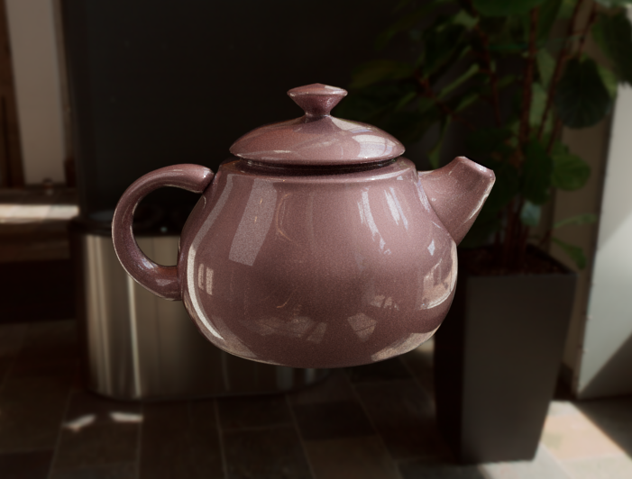
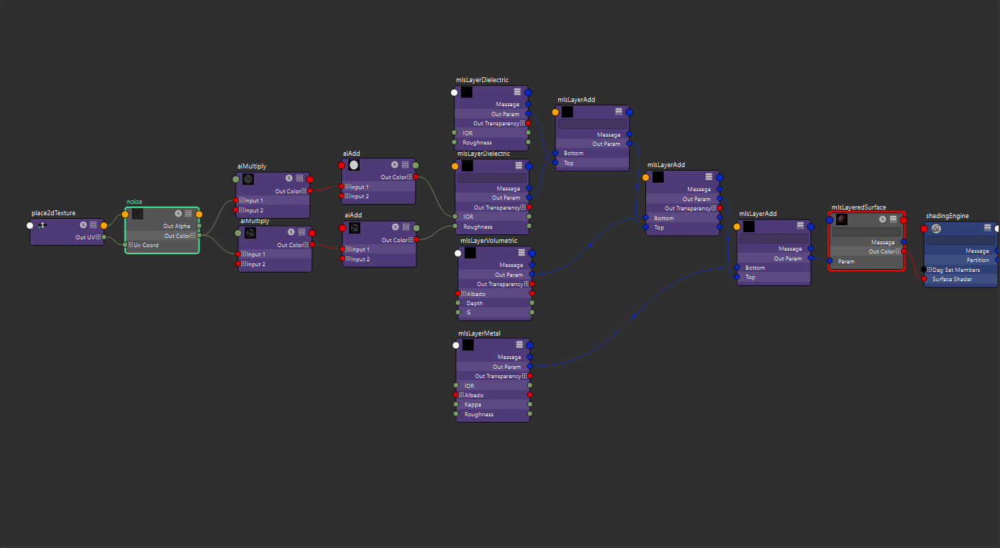

## Image

## Parameters

-   Dielectric Layer1

    -   roughness 0.002
    -   ior 1.5

-   Dielectric Layer2

    -   roughness 0.3 \* noise1.r
    -   ior 1.0 + 1.5 \* noise1.r
    -   noise1 parameters:
        -   amplitude 2.0
        -   frequency 192.0
        -   implode 0.1
        -   density 0.1

-   Volumetric Layer

    -   albedo (1, 1, 1)
    -   depth 0.1
    -   g 0.7

-   Metal Layer
    -   albedo (1, 0.7, 0.7) can be changed to other colors
    -   ior 0.2
    -   kappa 5.0
    -   roughness 0.5
