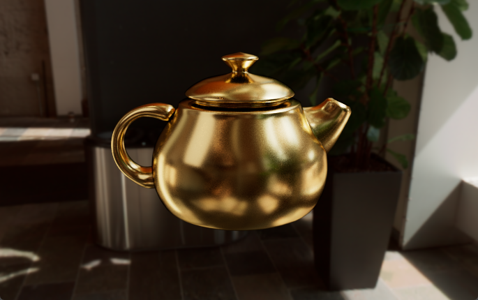

## Image

## Parameters

-   Volumetric Layer

    -   albedo (1, 1, 1)
    -   depth 0.2
    -   g 0.7

-   Metal Layer

    -   albedo (0.958, 0.776, 0.373)
    -   ior 0.654
    -   kappa 2.666
    -   roughness 0.001

    (Can changed to other metal):

    Copper

    -   albedo (0.953, 0.721, 0.504)
    -   ior 0.735
    -   kappa 3.005

    Silver

    -   albedo (0.966, 0.949, 0.922)
    -   ior 0.149
    -   kappa 3.286

    Iron

    -   albedo (0.543, 0.512, 0.496)
    -   ior 2.799
    -   kappa 2.960

    Aluminum

    -   albedo (0.907, 0.914, 0.919)
    -   ior 1.083
    -   kappa 6.581
